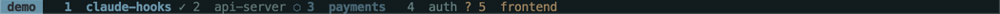
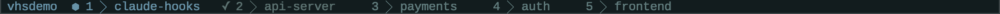
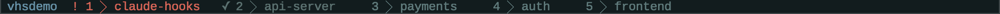
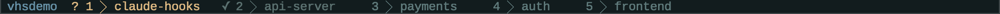
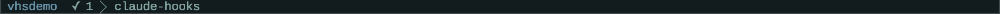
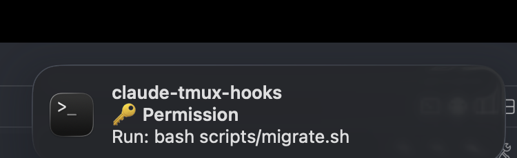
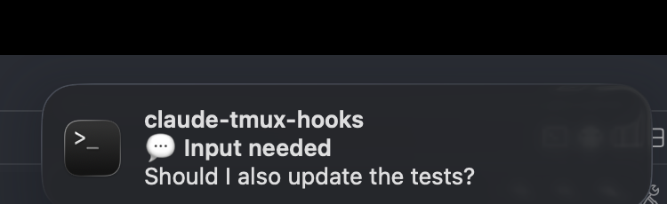

# claude-tmux-hooks

Per-window Claude Code status in your tmux tab bar — animated indicator, event-driven, zero polling.



Open five Claude sessions in five windows. Each tab tracks its own state, live:

| State | Glyph | Color | When |
|-------|-------|-------|------|
| running | `⬢` *(animates)* | cyan | Claude is executing a tool |
| input | `?` | amber | Claude is waiting for your reply |
| permission | `!` | red | Claude needs approval to run a command |
| done | `✓` | green | Claude finished without a question |
| *(idle)* | — | dim | No active Claude session |







On macOS you also get desktop notifications:




**No polling. No cron. No background daemons.** State changes are triggered by [Claude Code hooks](https://docs.anthropic.com/en/docs/claude-code/hooks) at the exact moment each lifecycle event fires.

## Install

```bash
git clone https://github.com/LiveNL/claude-tmux-hooks
cd claude-tmux-hooks
bash install.sh
```

The installer:
- Copies hook scripts to `~/.claude/hooks/`
- Merges the hook configuration into `~/.claude/settings.json` (backs up first, preserves existing hooks)
- Guides you through the single tmux config line

### Requirements

- [tmux](https://github.com/tmux/tmux) ≥ 3.0
- [jq](https://stedolan.github.io/jq/)
- [Claude Code](https://docs.anthropic.com/en/docs/claude-code) CLI

macOS notifications use `osascript` — no extra packages needed. Install [`alerter`](https://github.com/vjeantet/alerter) to make notifications **clickable**: clicking one focuses your terminal and switches directly to the tmux window where Claude is running.

```bash
brew install vjeantet/tap/alerter
```

On other platforms notifications are silently skipped.

## tmux setup

Add **one** of these to `~/.tmux.conf`, then reload:

```bash
tmux source-file ~/.tmux.conf
```

**Option A — drop-in** (replaces `window-status-format` with a clean minimal style):

```tmux
source-file /path/to/claude-tmux-hooks/tmux/claude-state.conf
```

**Option B — embed in your existing theme** (keeps your current format, prepends the indicator):

Copy the `#{?...}` fragment from `tmux/claude-state-prefix.txt` to the start of your existing `window-status-format` and `window-status-current-format` strings.

## How it works

Claude Code fires hook scripts at exact lifecycle transitions. Each script sets a window-scoped tmux variable (`@claude-state`), which the status-bar format reads to render the right glyph — no polling, just tmux variable reads on each status-bar refresh.

```
UserPromptSubmit / PreToolUse  →  busy-window.sh       →  @claude-state = "running"  + spinner loop starts
PostToolUse                    →  continue-window.sh   →  @claude-state = "running"  (restores after permission grant)
PermissionRequest              →  permission-window.sh →  @claude-state = "permission"
Stop / Notification            →  notify.sh            →  @claude-state = "input" | "done"
SessionStart                   →  reset-window.sh      →  @claude-state = ""          + spinner loop stops
```

The animated spinner is a lightweight background process that writes a new frame to `@claude-spinner` each second and is killed the moment Claude stops. Because `@claude-state` is window-scoped, every tmux window tracks its own Claude session independently — run as many sessions in parallel as you like.

## Customization

**Colors:** Edit `tmux/claude-state.conf` and replace the named colors (`cyan`, `yellow`, `red`, `green`) with your theme's values (e.g. `colour14`, `#fabd2f`).

**Spinner frames:** Edit the `frames=(⬢ ⬡)` array in `hooks/busy-window.sh` — any Unicode glyphs work.

**Clickable notifications:** Install `alerter` (`brew install vjeantet/tap/alerter`). When present, clicking a notification focuses your terminal and switches to the right tmux window automatically.

**Desktop notifications:** Set `CAN_NOTIFY="0"` near the top of `hooks/notify.sh` to disable, or swap `notify_macos` for `notify-send`/`paplay` for Linux.

**Debug logging:** Set `DEBUG_CLAUDE_HOOKS=1` in your environment to log hook events to `/tmp/claude-notify.log`.

## Uninstall

```bash
rm ~/.claude/hooks/busy-window.sh \
   ~/.claude/hooks/continue-window.sh \
   ~/.claude/hooks/notify.sh \
   ~/.claude/hooks/permission-window.sh \
   ~/.claude/hooks/reset-window.sh \
   ~/.claude/hooks/spinner.sh
```

Then remove the `hooks` block from `~/.claude/settings.json` and the `source-file` line from `~/.tmux.conf`.
